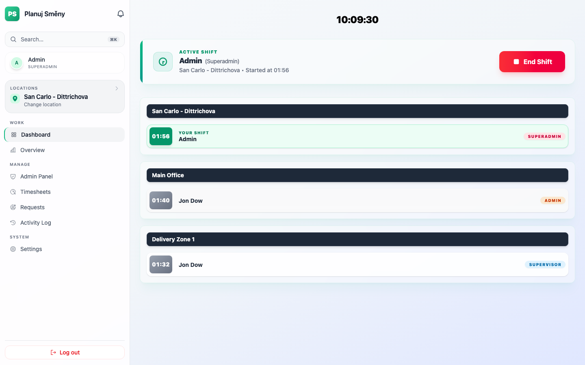
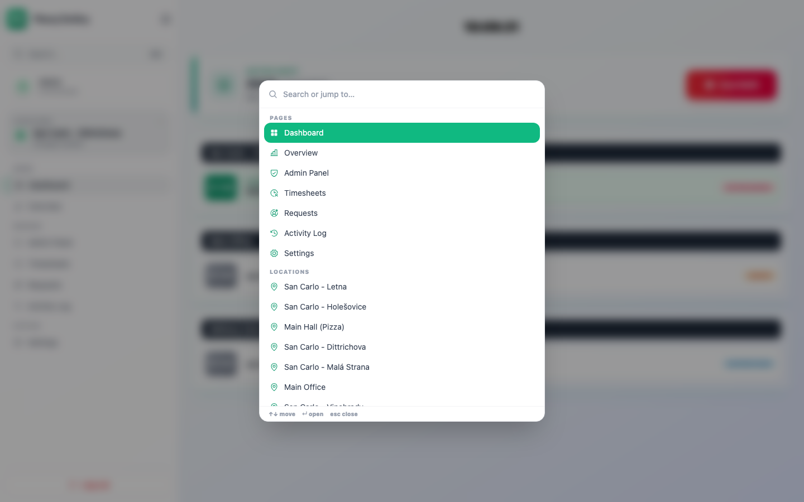
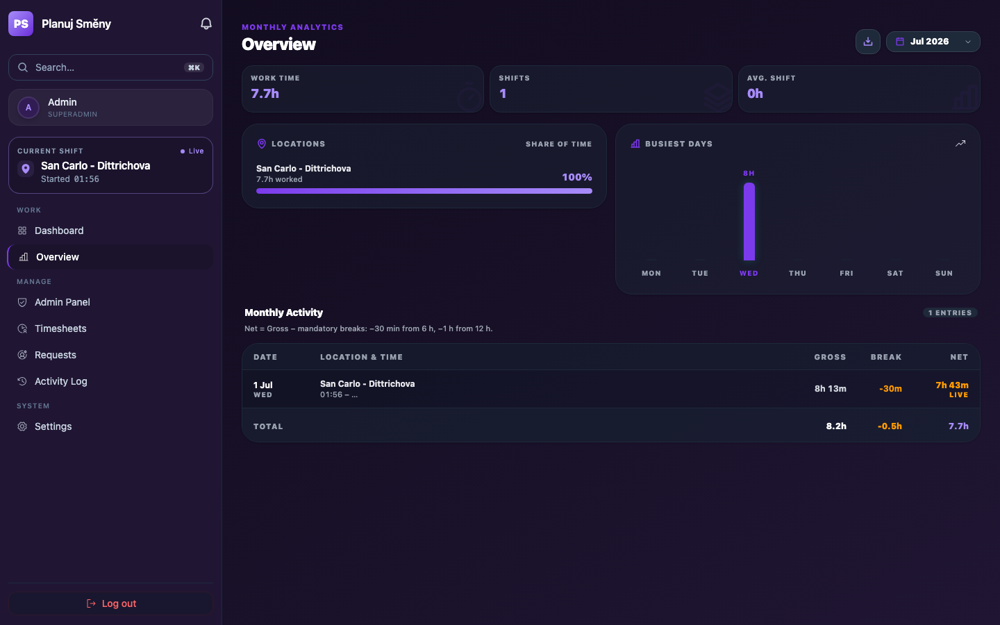
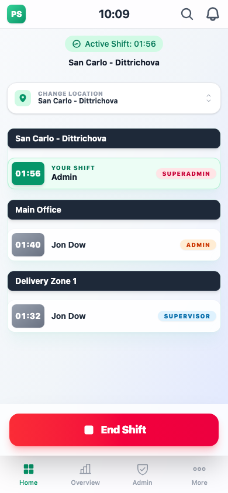
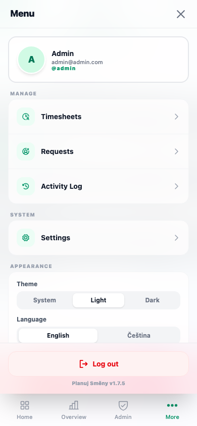

# Planuj Směny

A modern, cross-platform **shift-management** app for teams. Employees clock in
and out by location in real time; managers and admins oversee organizations,
locations, people and requests — on the web or as a native Android/iOS app.

> **Status: active development (beta).** Features and UI change frequently.
> _Version 1.8.0 · last updated: July 1, 2026._ · See the [Roadmap](ROADMAP.md).

---

## 📸 Screenshots

| Dashboard | Command palette (⌘K) |
| :--: | :--: |
|  |  |

| Overview — dark, Violet motif | Mobile (home · More) |
| :--: | :--: |
|  |   |

---

## ✨ Features

### Shift tracking
- **Clock in / out by location**, with mid-shift location switching and a
  confirm/switch popup.
- **Live board** — see who's on shift right now, updating instantly via Supabase
  Realtime (with automatic reconnect). The board shows only locations with
  activity, so it scales with the team, not the location count.
- **Auto-end at midnight** — shifts left open overnight are closed automatically
  at Europe/Prague midnight by a scheduled job.

### Timesheets & analytics
- **Overview** (per employee): monthly analytics — total/avg hours, shift count,
  busiest days, share-of-time per location — with **mandatory-break math** baked
  in (−30 min from 6 h, −1 h from 12 h).
- **Timesheets** (managers+): pick a member, review/add/edit/delete their shifts
  for a month, with an overnight-shift-aware time picker.
- **Exports** as **PDF / Excel / CSV**, per employee or the whole team; on native
  they open the OS **share sheet**, on web they download.
- **Activity Log** (admins+): append-only feed of administrative changes.
- Months are bucketed by the viewer's **local** calendar month (no UTC-boundary
  surprises).

### Admin & roles
- **Admin Panel** for Organizations (Superadmin), Locations (owners), and
  Employees (admins): create / edit / delete, with search.
- **Ranked role hierarchy** enforced in the database (RLS), not just the UI.
- **Invite by email** — new members are provisioned into the right organization
  and role atomically, finishing onboarding on a branded `/accept-invite` page.

### Requests
- Dedicated **Requests** hub. **Name-change requests**: staff file a request an
  admin approves; approval applies the new name automatically. **Username** is
  self-service but rate-limited to once every 7 days.

### Notifications
- **In-app bell** — a personal feed of what concerns you: shift changes to your
  schedule, name-change decisions, and admin edits to your profile.
- **Push notifications** (Firebase Cloud Messaging, native): the same events,
  delivered to your device, with **per-category preferences** (master switch +
  shift / account / requests) in Settings. Tapping opens the relevant screen —
  or the notifications panel when there's no dedicated one.

### Navigation
- **Command palette** (**⌘K / Ctrl K**) to jump to any page or location.
- Grouped sidebar (Work / Manage / System) + a searchable location picker with
  recent posts.

### Localization & theming
- **English / Čeština** throughout, with a 12h/24h time-format option and
  locale-aware dates.
- **Colour schemes** (Emerald / Cyan / Amber / Violet) + **Light / Dark / System**
  themes, with native status-bar sync.

### Mobile (Capacitor)
- Native-style bottom tab bar + a "More" control center (grouped nav, quick
  theme/language, app version).
- **Pull-to-refresh**, **haptics**, **skeleton** loading states, and the Android
  **hardware back button** dismisses open overlays before navigating.
- Safe-area handling, splash/keyboard/status-bar plugins, native share, and
  push notifications.
- **PWA-ready** — installable from the browser (Add to Home Screen).

---

## 🛠 Tech stack

| Layer | Tech |
| --- | --- |
| Frontend | React 19 + TypeScript, Vite 7 |
| Routing / state | React Router 7, TanStack Query 5 |
| Styling / motion | Tailwind CSS v4, Framer Motion, Phosphor icons |
| i18n | Custom lightweight `t()` + EN/CS dictionaries |
| Validation | Zod |
| Reports | jsPDF + jspdf-autotable, SheetJS (xlsx, lazy-loaded) |
| Backend | Supabase — Postgres, Auth, Realtime, Edge Functions, pg_cron |
| Native | Capacitor 8 (Android & iOS) — push, share, filesystem, haptics, keyboard, splash, status-bar |
| Tooling | ESLint 9, Prettier, Vitest, Yarn 4 (Corepack) |

---

## 🧱 Architecture

```
src/
├─ app/            # shell, layout (AppShell, Sidebar, BottomNav), command palette,
│                  # navigation config, providers, router guards
├─ features/
│  ├─ auth/        # login, accept-invite, AuthContext, route guards
│  ├─ shifts/      # clock in/out, realtime, Overview + export
│  ├─ locations/   # location picker (recent + search), confirm/switch popup
│  ├─ timesheets/  # admin shift management, exports, Activity Log
│  ├─ admin/       # Admin Panel: orgs / locations / employees / roles
│  ├─ requests/    # Requests hub (name-change approvals)
│  ├─ notifications/# in-app bell + push registration + preferences
│  ├─ profile/     # profile editing
│  └─ settings/    # appearance, language, time format, notifications
└─ shared/         # api client, types (zod), i18n, UI components, hooks, utils
supabase/
├─ migrations/     # SQL schema, RLS policies, triggers, cron
└─ functions/      # Edge Functions (Deno)
```

### Roles & permissions

| Role | Rank | Can |
| --- | --- | --- |
| Superadmin | 100 | Everything, across all organizations |
| Head Admin | 40 | Manage own org incl. locations ("owner") |
| Admin | 30 | Invite & manage members below them; review requests |
| Manager | 20 | Timesheets + admin panel |
| Supervisor | 10 | Shift control |
| Employee | 0 | Own shifts only |

Capability rules (assigning roles below your own, no self-escalation, org
scoping) are enforced by **RLS policies + triggers** in the database, so they
hold even for direct API calls — the UI just mirrors them.

### Edge Functions (`supabase/functions/`)
- **`invite-employee`** — invites a user and provisions org + role.
- **`delete-employee`** — removes a member with rank/org checks.
- **`username-login`** — resolves a username to an email for sign-in.
- **`send-push`** — sends FCM (HTTP v1) pushes from Database Webhooks
  (`shift_audit_log`, `name_change_requests`), honouring per-user preferences.

---

## 📦 Getting started

Uses **Yarn (Berry v4, via Corepack)** — single lockfile (`yarn.lock`); version
pinned in `package.json` (`packageManager`). Don't add `package-lock.json`.

```bash
corepack enable          # once (ships with Node 18+)
yarn install
cp .env.example .env      # then fill in the values below
yarn dev                 # Vite dev server, exposed on your LAN (--host)
```

### Environment variables
| Variable | Description |
| --- | --- |
| `VITE_SUPABASE_URL` | Supabase project URL, e.g. `https://<ref>.supabase.co` |
| `VITE_SUPABASE_PUBLISHABLE_KEY` | Supabase publishable (anon) key. **Never** ship the `service_role` key to the client. |

The displayed app version is injected from `package.json` at build time.

### Local Supabase
```bash
supabase start            # boot local stack (Docker)
supabase db reset         # apply migrations + seed (supabase/seed.sql)
supabase functions serve  # run Edge Functions locally
```

### Build for native
```bash
yarn build
npx cap sync
npx cap open android   # or: npx cap open ios
```

### Push notifications (native)
Push requires Firebase (FCM). In short: create a Firebase project, add the
Android app (`com.planujsmeny.app`), drop `google-services.json` into
`android/app/` (gitignored), then deploy the function and wire the webhooks:
```bash
supabase secrets set FCM_SERVICE_ACCOUNT="$(cat service-account.json)"
supabase functions deploy send-push --no-verify-jwt
```
Create Database Webhooks (INSERT) on `shift_audit_log` and
`name_change_requests` pointing at the `send-push` function. Keep the Firebase
**service-account key out of git** (it's ignored).

---

## 🧰 Scripts
| Script | What it does |
| --- | --- |
| `yarn dev` | Vite dev server (LAN-exposed) |
| `yarn build` | Type-check + production build (`tsc -b && vite build`) |
| `yarn typecheck` | Type-check only |
| `yarn lint` | ESLint |
| `yarn format` | Prettier write |
| `yarn test` / `test:watch` | Vitest (run / watch) |

---

## 🚢 Deployment

- **Hosting:** Vercel. `master` → **production**; `dev` / `preview` → preview
  deployments. SPA rewrites are configured in `vercel.json`.
- **Database:** two Supabase projects — **prod** and **preprod** — kept in sync
  via the migrations in `supabase/migrations/`. CI (`verify`) runs lint, tests
  and the build on every PR.
- **Versioning:** semver tags (`vX.Y.Z`) + GitHub Releases per release.

---

## 🔒 Security

- **Row Level Security** on every table; organization isolation + the role
  hierarchy are the source of truth (UI only mirrors them).
- Keep the `service_role` key and the Firebase **service-account key**
  server-side only (Edge Function secrets); both are gitignored.
- Don't ship default demo credentials to any shared environment — rotate the
  seeded admin's password and pick a non-obvious username first.

---

_Created by Anuar Kairulla._
